<!-- ============ HEADER ============ -->

  

  

Software development student from Colombia — building real projects to grow from theory to practice. 
Interested in web development, clean code, and solving problems end-to-end.

  

---

<!-- ============ CONNECT ============ -->

### 🌐 Connect with me

&nbsp;

---

<!-- ============ TECH STACK ============ -->
##  Tech Stack

### 💻 Languages

### 🌐 Frontend

### ⚙️ Backend

### 🗄️ Databases

### 🛠️ Tools & DevOps

### 🎨 Design & Other

---

<!-- ============ FEATURED PROJECTS ============ -->
## 🚀 Proyectos destacados

🎮 <b>Zona Segura</b> — <a href="https://juanezzzzz.github.io/zona-segura-sst/">demo jugable en vivo</a> &nbsp;·&nbsp; 🛍️ <b>Dulce Encanto</b> — e-commerce con React + Vite &nbsp;·&nbsp; 🧩 <b>Tienda</b> y <b>Suscripciones</b> — microservicios REST en <b>Go + PostgreSQL</b> (plataforma <b>Jobsy</b>)

---

<!-- ============ GITHUB STATS (tu propia instancia) ============ -->
##  GitHub Stats

<!-- ============ ACTIVITY GRAPH ============ -->

<!-- ============ SNAKE (requiere el GitHub Action; ver nota abajo) ============ -->

<picture>
  <source media="(prefers-color-scheme: dark)" srcset="https://raw.githubusercontent.com/juanezzzzz/juanezzzzz/output/github-contribution-grid-snake-dark.svg" />
  <source media="(prefers-color-scheme: light)" srcset="https://raw.githubusercontent.com/juanezzzzz/juanezzzzz/output/github-contribution-grid-snake.svg" />
  
</picture>

---

  

---

<!-- ============ FOOTER ============ -->

📍 **Yopal, Colombia** &nbsp;·&nbsp;
🌐 **Spanish (Native) · English B1** &nbsp;·&nbsp;
💼 **Open to Junior Roles & Collaboration**

⚡ Outside of code: always learning something new · binge-watching series · gaming

 

